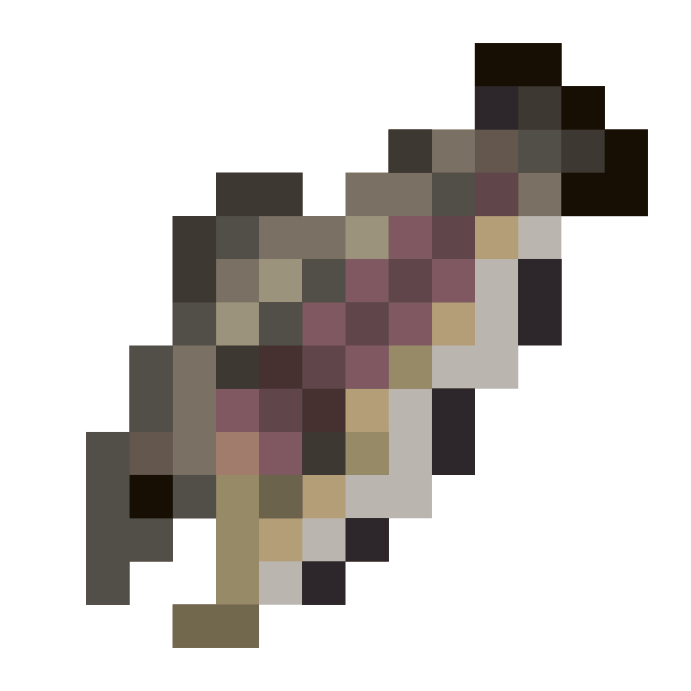

# TroutToss

## About

TroutToss is a simple plugin that adds throwable raw salmon to Minecraft, which give knockback on impact.

## Purpose

This project was created for a private friend server as a fun mechanic for a useless item. We called raw salmon "trout"
as a joke, which is where this plugin gets its name.

## Usage

Simply punch while holding a raw salmon. A salmon will be launched in the direction you look, consuming one raw salmon
item unless you are in creative mode. On impact with an entity, the salmon will knock back the entity based on the
trajectory of the salmon. The salmon will also return to its item form on impact, unless you are in creative mode.

### Trout Tech

There are some unintended mechanics added to the game based on how this plugin works, which my friends and I have
labeled as "Trout Tech." Basically, you can use trout to give yourself vertical and horizontal jump boosts. These can
help you jump further, climb walls, fly, and negate fall damage. This alone makes raw salmon a much more useful resource
than before.

## Requirements

- Spigot or Paper 1.13 - 1.19
- Java 8 or higher

## Installation

1. Download the latest release.
2. Put the jar in your plugins folder.
3. Start or restart your server.

## Configuration

There is no configuration for this plugin. I don't plan on adding any configuration either, as this plugin is just for
fun.

## Demonstration

## Building

1. Clone or download this repository.
2. Run `./gradlew shadowJar` in the directory of the project.
3. `/build/libs/TroutToss.jar` should have been generated.

You can also grab `TroutToss.jar` from the latest releases.